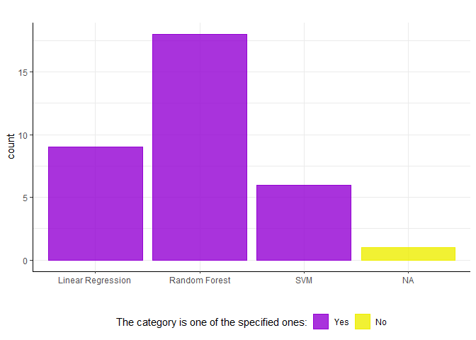
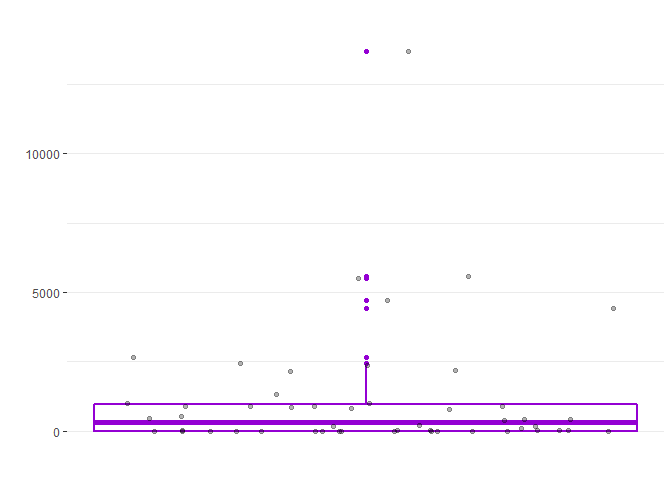

# dqtesting

The goal of the package is to provide an easy toolset for data quality
testing. The main function `perform_dqtest` returns a list containing
various results from an univariate DQ test. Moreover functions are
provided that allow a very easy interface to the Local Outlier Factor
Algorithm for multivariate outlier detection (therefore automated
hyperparameter tuning).

## Web Interface

There is a web application to the package:
[Link](https://esommer.shinyapps.io/dqtesting/)

## Installation

You can install the released version of dqtesting from Github in R with
the following line of code:

``` r
# install.packages("devtools")
devtools::install_github("EmanuelSommer/dqtesting")
```

## Some examples

The `dummy_data` is a dummy data set contained in the package.

``` r
library(dqtesting)
# quick overview of the dummy data
str(dummy_data)
#> Classes 'tbl_df', 'tbl' and 'data.frame':    50 obs. of  13 variables:
#>  $ num1     : num  -1.00 1.79e-02 3.60 7.49e-02 9.13e-07 ...
#>  $ num2     : num  -1 14.7 38.7 2671 425.9 ...
#>  $ num3     : num  4 -140 292 230 -139 ...
#>  $ num4     : num  1.33 -46.81 97.22 76.77 -46.31 ...
#>  $ char1    : chr  "Random Forest" "Linear Regression" "Random Forest" "Random Forest" ...
#>  $ log1     : logi  TRUE FALSE TRUE TRUE FALSE TRUE ...
#>  $ datetime1: POSIXct, format: "2005-05-09 22:22:00" "2005-05-09 11:11:11" ...
#>  $ datetime2: POSIXct, format: "2005-05-09 02:00:40" "2005-05-09 12:11:50" ...
#>  $ date1    : Date, format: "2005-05-09" "2005-05-09" ...
#>  $ num5     : num  5.68 5.82 4.28 2.49 5 ...
#>  $ datetime3: POSIXct, format: "2100-01-04 00:02:00" "2100-01-04 00:04:00" ...
#>  $ date2    : Date, format: "2100-01-05" "2100-01-06" ...
#>  $ fact1    : Factor w/ 4 levels "Linear Regression",..: 3 1 3 3 NA 1 2 2 1 1 ...
```

These are basic examples which show you how to solve some common
problems:

Given: The data should not contain missing values, the data should have
a certain range or contain categories and moreover some values can be
excluded as they represent special cases. To check these data quality
requirements the function `perform_dqtest` can be used in the following
way.

``` r
library(dqtesting)
### first variable: char1 with allowed categories "Random Forest", "Linear Regression" and "SVM", "Neural Networks" should be excluded.
dq_char <- perform_dqtest(dummy_data$char1,
                          categories = c("Random Forest","Linear Regression","SVM"),
                          exclude_values = "Neural Networks")
# access the absolute and relative amount of NA's
dq_char$abs_na
#> [1] 1
dq_char$rel_na
#> [1] 0.02

# access the absolute and relative amount of excluded values
dq_char$exclusions$abs_excluded
#> [1] 16
dq_char$exclusions$rel_excluded
#> [1] 0.32

# access a statistical summary
dq_char$stat_summary
#> # A tibble: 4 x 3
#>   x                 absolute relative
#>   <chr>                <int>    <dbl>
#> 1 Random Forest           18     0.36
#> 2 Linear Regression        9     0.18
#> 3 SVM                      6     0.12
#> 4 <NA>                     1     0.02

# access the categories check
dq_char$cat_check
#> [1] "There are unspecified categories!"

# access a visualisation
dq_char$barplot
```



``` r

### second variable: num2 should be non negative
dq_num <- perform_dqtest(dummy_data$num2, range_min = 0)

# access the 0.4 quantile of the vector
dq_num$stat_summary$quantiles11[4]
#> [1] 11.4668

# access the minimum of the vector
dq_num$stat_summary$quantiles11[1]
#> [1] -1

# access the range check
dq_num$range_check
#> [1] "Minimum out of range."

# access a different visualisation
dq_num$boxplot
```



``` r

### third variable: datetime2
dq_datetime <- perform_dqtest(dummy_data$datetime2)

# access a visualisation about the weekdays
dq_datetime$hist_wday
```


These were just a few examples of this very flexible function.

If multivariate outliers should be detected too, the package provides
some useful functions:

``` r
# perform the LOF Algorithm
lof_list <- lof_fun(dummy_data[,c(3,4)])
# extract the most suspicious values
extract_rows_score(dummy_data[,c(3,4)],lof_list,threshold = 1.5)
#> # A tibble: 5 x 3
#>    num3  num4 LOF_scores
#>   <dbl> <dbl>      <dbl>
#> 1 -372.   10        1.98
#> 2 -209.   10        1.84
#> 3  337.  112.       1.70
#> 4 -333. -111.       1.67
#> 5 -330. -110.       1.65
# visualize the results
lof_vis(dummy_data[,c(3,4)],lof_list)
```


Detailed help pages are available for all functions. For example just
type `?perform_dqtest` into the console.

Have fun :)
